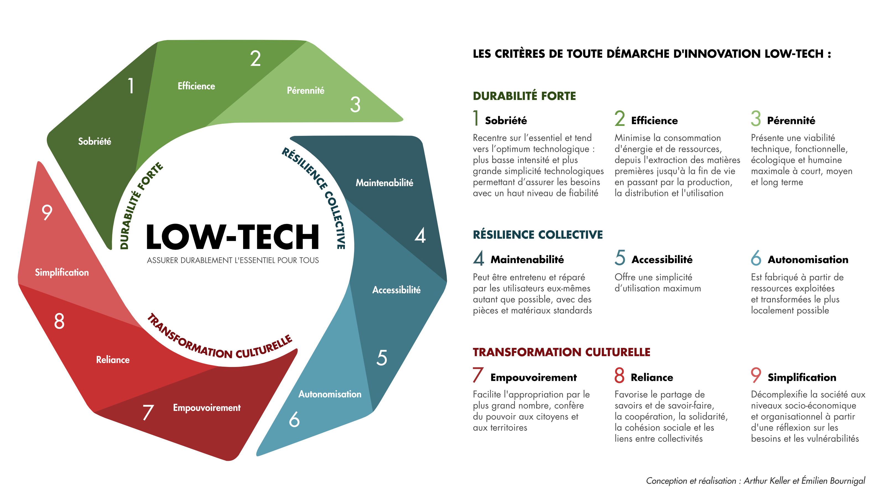

Voilà plus d'un an que nous somme sur Saint-Pierre-et-Miquelon et de nombreuses années que nous voyageons lentement et sûrement. Lors de nos escales longues, se pose le problème de la mobilité.

> En général, nous pouvons tout faire à pied ou à vélo. Mais certains trajets (transport de matériel, courses, acheminement des enfants à l'école) s'avèrent difficiles sans une voiture traditionnelle.

Adepte des [Low-techs](https://fr.wikipedia.org/wiki/Low-tech), je tombe dès ses débuts sur un projet un peu curieux : le [Vhélio](https://vhelio.org). Petit à petit, je vois des modèles sortir, leurs créateurs s'en servir et ça me fait de plus en plus envie !

:::tip[L'idée de ce "Vhélio" me travaille]
Je me dis qu'un tel véhicule serait parfait pour mes besoins&nbsp;:

- **Facilitateur** pour tous les trajets du quotidiens (courses, enfants, etc.).
- **Réparable** grâce à des pièces courantes, faciles et rapides à obtenir.
- **Démontable** et transportable, pour l'acheminer d'un endroit à un autre.
- **Autonome** en énergie, pour les trajets longs et les endroits isolés.

Et en fin de compte, dans la plupart des îles que nous fréquentons, nous sommes nombreux à avoir les mêmes contraintes. C'est pourquoi l'idée de ce prototype est née.
:::
