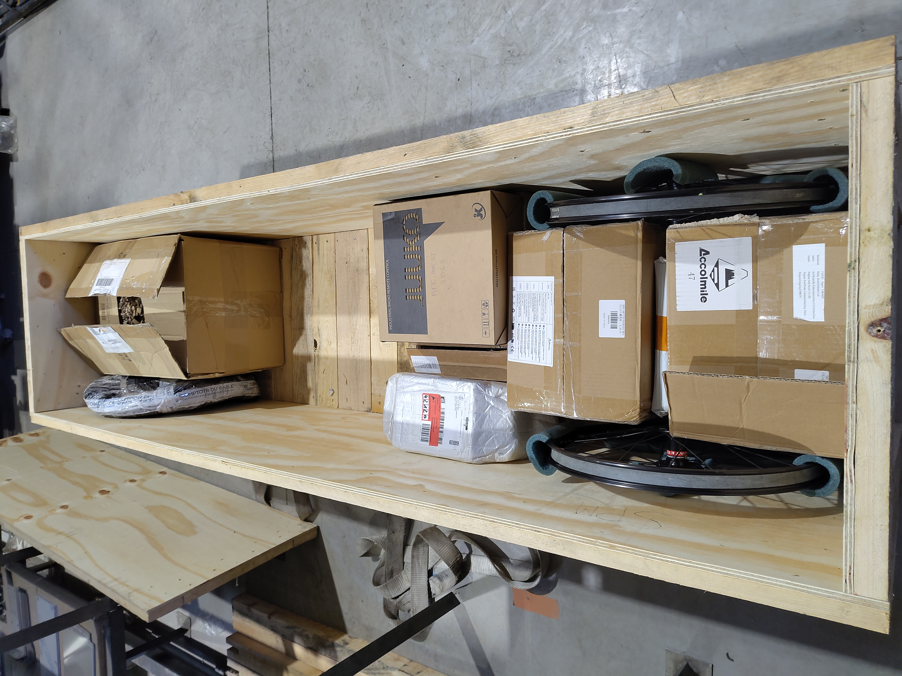

# Le colis en préparation

_Photo MFE_

La caisse contenant la grande majorité des pièces du Vhélio est en préparation chez [MFE](https://makinnox.com/categorie-produit/cycles/). Compte tenu de la disponibilité des produits, voici ce qu'il en est de l'avancement du Vhélio.

## Electronique / électricité

La batterie du vhélio SPM sera montée sur mesure, elle aura une capacité 4x supérieure au jeu de batteries vélo classique et malgré tout une augmentation maîtrisée du poids dans une zone basse et centrale qui devrait participer à la stabilité du véhicule.

Pour la partie électrique et électronique, j'aurai ce qu'il faut pour une version programmable du système (Arduino + carte relais). Les moteurs en vente sont malheureusement tous accompagnés de contrôleurs CAN, il faudra certainement adapter un contrôleur et afficheur UART séparément au besoin.

:::note[CAN vs UART ?]
Le moteur (sa puissance, son déclenchement, etc.) est contrôlé par une carte électronique située dans l’afficheur ou dans un contrôleur dédié. L’afficheur/contrôleur applique les règles fixées par le fabricant (limitation de puissance, conditions d’assistance, poignée d’accélération, etc.).
La communication entre le moteur, l’afficheur et éventuellement un ordinateur se fait via un protocole, généralement CAN ou UART.

- **CAN** : protocole moderne, robuste, tolérant aux erreurs et largement utilisé dans l’industrie. Il peut cependant être verrouillé par certains fabricants, ce qui limite la reprogrammation.
- **UART** : protocole plus simple et plus ancien, facilitant l’accès aux données. Sur certains systèmes (ex : moteurs Bafang), il permet une reprogrammation complète.
:::

La panneau solaire ne peux pas rentrer dans la boite, il faudra en acheter un à la bonne taille ailleurs. La question reste en suspend, le vhélio pourra être construit sans lui dans un premier temps.

## Pièces de vélo

J'en ai pris pas mal en double (notamment les pignons) afin de pouvoir faire des ajustements au besoin. Elles sont assez nombreuses (moyeu et accessoires, système de transmission, pédalier, freinage avant et arrière, roues, etc.).

## Chaudronnerie

MFE s'occupe de toutes les pièces à usiner, dont un [adaptateur pour moteur bafang](https://makinnox.com/produit/cho38-tube-pour-boitier-de-pedalier/) en plus du [kit vhéliotech](https://makinnox.com/produit/lot-chaudronnerie-pour-vheliotech-version-integrale/). Il faut y ajouter l'essentiel de la boulonnerie, les joints de bords de tôle et autres petits accessoires.

## Pièces supplémentaires

Un chargeur / générateur DC permettant de recharger la batterie entière ou des cellules individuelles, des outils spécifiques pour les montages vélo (chaîne, rayon, moyeu...) ainsi que pas mal de petits accessoires (gaine électrique, passe-fils, serre-fils, bouchons de tubes, disjoncteurs, fusibles, rétroviseurs, etc.) ont été prévus.

## Petit inventaire à cette date

Dispo :

- Moteur BBS01B 48V 250W CAN sans écran (FR)
- Moteur BBS02B 48V 750W / écran VD03 (CAN)
- Moyeu Enviolo Heavy Duty 135mm m10 36 trous 100N.M
- Outil pour ajuster les rayons
- Poignée frein simple
- phares
- Porte bidon
- Bornier x2 rouge + noir m6
- Prise allume-cigare
- Disjoncteurs solaires 20A + boitier étanche
- Prises solaires 6 mm² 5 paires x2 = 10 paires
- Roues stabilisatrices x2
- Tous les câbles + cosses chez comptoir-du-cable
- Smartsolar 100 30 MPPT Victron
- Connecteurs 6,3mm supplémentaires MF 50 bleu 50 rouge
- Disjoncteur PV 10A x2 (au cas ou on a 2 panneaux)
- Roues avant (fabrication spéciale vhélio par "parlons cycles")
- Chargeur 60V 5A / Alim stabilisée
- Plateaux supplémentaire bafang 36 dents + 48 dents
- Outils pour gérer la chaîne
- BMS JK avec écran 100A 16S
- USB + Voltmètre
- Comodo / commande clignotants x2
- Commande phares
- Lampes rouges et oranges pour feux 2x4
- Feux recul blanc (identique à rouges oranges) x4
- Passes-fil étanchéité 2x10
- Range-fil (5mx 10mm, 5m x 20mm)
- Gaine thermo (4 à 24mm x 1m x 8pièces)
- Connecteurs petits cables bleus / rouges 60pc x 2
- Range-fil electrique réutilisable
- Rétroviseur
- Sonnette vélo
- Câbles frein 2m x5 inox
- Bandes réfléchissantes autocollantes 10m rouge,blanc, vert
- Pédales
- IO board arduino nano
- Arduino nano type-c x3
- Coupe-batterie x2
- Cosses m6 16mm² x10
- Chaîne single speed 106 maillons x3
- Étrier de frein BB7 x3
- Gaîne tressée cable elec 3m 8mm x2
- Connecteurs électriques étanches (petits cables) kit
- Ruban de guidon
- Boitier électrique étanche 220x170x110
- Convertisseur 36-48 → 12V 10A
- Shift sensor bafang
- Serre-cables x100
- Klaxon électrique 120db VTT
- Connecteurs étanches 2 poles x10
- Bouchons tubes ronds 22 25
- Disques pour freins x3
- Disques pour freins x3 (bis)
- Pignon pour tendeur de chaîne
- Porte-fusibles
- Câbles vitesses 2m x5 inox
- Joint bord de tole 3m

Encore en transit (ou perdu...) :

- BMS 16s 60A Daly (bms de secours)
- Bouchons tubes carrés 25x25 x100
- Module relais RS485
- Pièces détachées ENVIOLO (ebike24)
- Cellules lifepo4 16x105Ah + 4x105Ah – 200*130*38mm (exp. FR)
- Poignée frein double
- tendeur de chaîne (noir & violet)
- Boulonnerie (boulons, vis, rondelles)

En suspend :

- Écran SW102 UART (adaptation UART)
- Contrôleur UART pour moteur 750W 48V (adaptation UART)
- Pneu 20x4 snow (pas dispo)
- Pneu classique 20x4 + chambre à air (pas dispo)
- jante arrière sans rayons x1 20x4 36 trous (ne convient pas)
- Chambre à air supplémentaire 20x4 (dépend des roues)
- Rayons pour la roue arrière (lot de 36) (dépend des jantes + moyeu)
- Fond de jante supplémentaire fatbike 20 (dépend des jantes)
- Jante avec moyeu et rayons fatbike 20x4 pouces x2 (avant - remplacement possible)
- Panneau solaire (passe pas dans la caisse)

Problèmes réglés :

- Cellules lifepo4 16x105Ah - annulé par le vendeur
- Joint bord de tôle 5m suppl. - annulé par le vendeur

## Roues fatbike, comment faire ?

_Photo Gregory Barrier_

Des roues "fat" cloutées serait vraiment très utiles à SPM en hiver (et même en été pour la version non cloutée). [Les essais de Gregory Barrier](https://communaute.vhelio.org/d/299-atelier-vhelio-greg-pres-orleans-22102024/9) ont d'ailleurs l'air concluants. J'ai pour le moment un problème d'approvisionnement et un questionnement en suspend sur le montage de la roue arrière.

# En guise de conclusion

Une fois que le colis arrivera dans l'archipel il devrait être rapide de monter le Vhélio dans la mesure ou les pièces sont bien compatibles entre elles et en nombre suffisant. Avant d'en arriver à la solution d'expédiier tout en une fois via MFE j'ai longuement étudié :

- La possibilité de m'approvisionner sur place, y compris la chaudronnerie.
- La possibilité de réaliser cela au Canada avec des prestataires canadiens.
- La solution de tout acheter moi même au compte goute.

Après de nombreuses heures passées à étudier ces options elles ont été mises de côté, soit pour des questions de faisabilité, soit à cause du coût excessif d'approvisionnement (optimisé par un envoi unique).

Autre détail chronophage : ne rien oublier de l'inventaire, s'assurer que toutes les pièces sont compatibles entre elles, faire les bons calculs (nombre de dents de pignons en fonction de la puissance moteur et du couple que le moyeu est capable de supporter, etc.).

Bref, la cerise sur le gâteau sera le montage ! J'ai bien hâte que ça arrive après toutes ces pérégrinations virtuelles.
