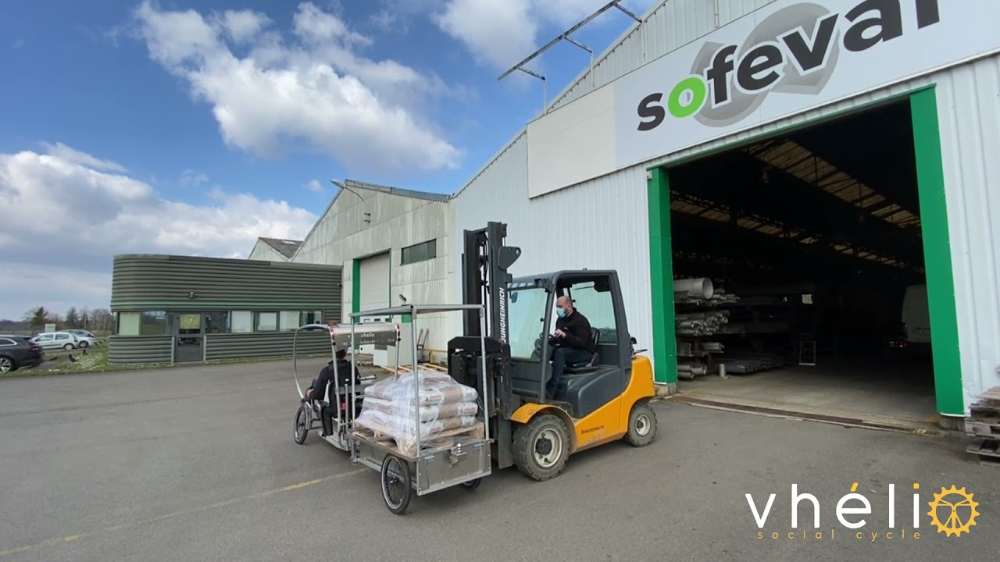

:::note
Le prototype proposé a pour objectif de disposer d'une version améliorée du Vhélio pour une utilisation à Saint-Pierre-et-Miquelon.
:::

### Le premier Vhélio d'outre-mer

Ce projet donnerait naissance au premier Vhélio fabriqué dans un territoire d'outre-mer. Il bénéficierait de ce fait du rayonnement lié à cette première auprès du monde de la mobilité douce et des médias.

### Adaptation au terrain et au climat

Le climat de l'archipel est de type océanique froid sous l'influence dominante de la mer et de ses embruns. Le matériel souffre donc davantage qu'ailleurs, en particulier quand il est composé d'acier. D'autre part, les hivers sont en général plus rudes que dans l'hexagone. C'est pourquoi nous proposons les optimisations suivantes : 

* **Des roues modifiées** pour une tenue de route optimisée sur un terrain accidenté, occasionnellement enneigé et au relief marqué.
* **Des matériaux résistants à la corrosion** (aluminium, inox) seront sélectionnés pour une durabilité améliorée, ainsi qu'un renforcement de l'étanchéité des parties électriques.
* **Un recharge par réseau EDF et optionnellement solaire à fort rendement** permettra de disposer d'un véhicule toujours opérationnel quand on en a besoin.
* **Une protection contre le vent et les embruns** sera élaborée pour permettre des trajets même quand la météo est difficile.

:::note[Recharge solaire dans le nord ?]
Le rendement des panneaux solaires a fait d'énormes progrès. Une expérience menée avec des panneaux Victron a validé la viabilité de ce matériel haut de gamme à Saint-Pierre.

- La recharge solaire sera maximale pendant 6 mois autour de l'été.
- En hiver, la recharge fonctionne partiellement, même en janvier.
- En complément, Vhélio peut être chargé via le réseau 230V.
:::

### Un construction DIY locale

Saint-Pierre-et-Miquelon est une terre isolée où l'approvisionnement en matériel peut s'avérer long et coûteux. En revanche, les habitants ont une expérience significative du travail manuel, qui correspond à l'esprit du Vhéliotech. Les matériaux et fournisseurs seront choisis de manière à :

* privilégier l'offre locale,
* faciliter et optimiser l'importation,
* optimiser les coûts,
* faciliter l'auto-construction,
* faciliter la réparabilité sur place.

