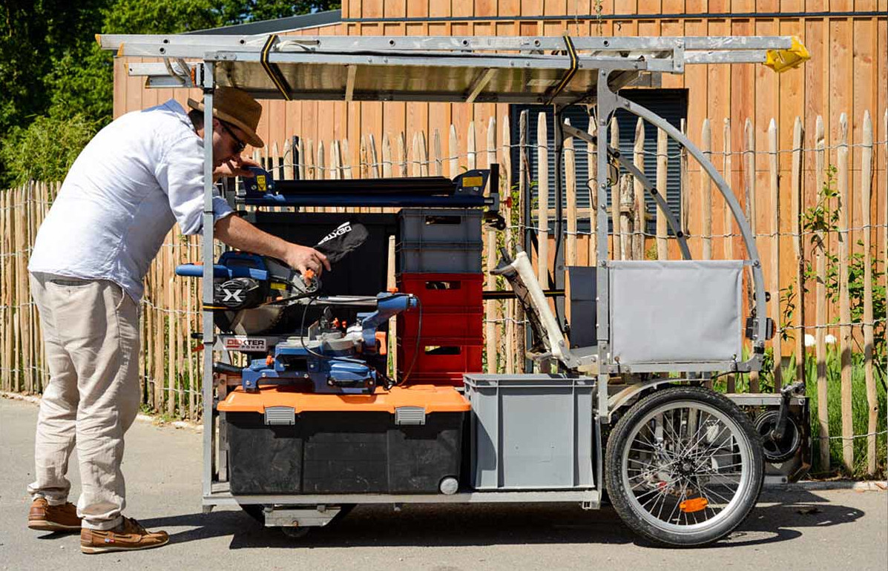
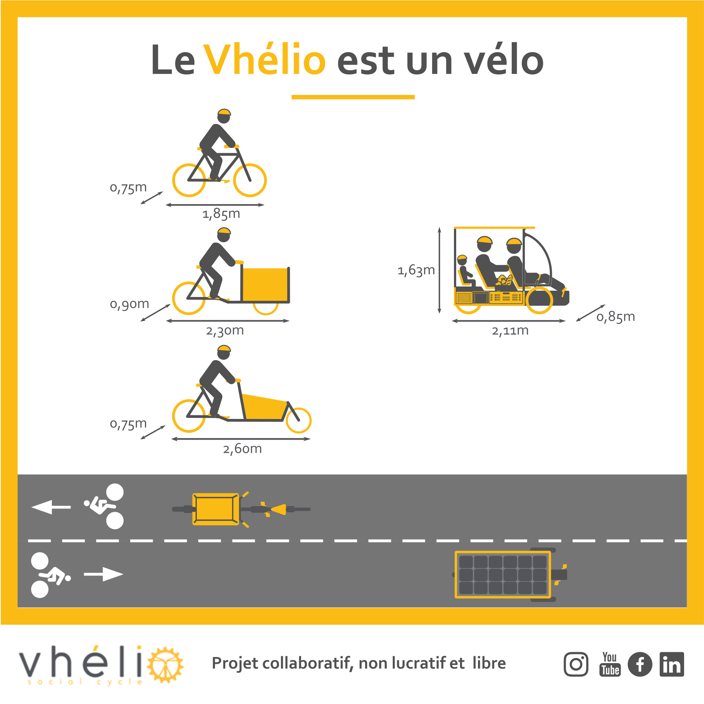
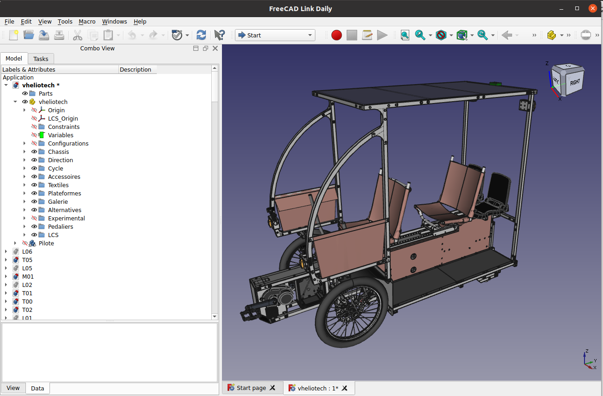
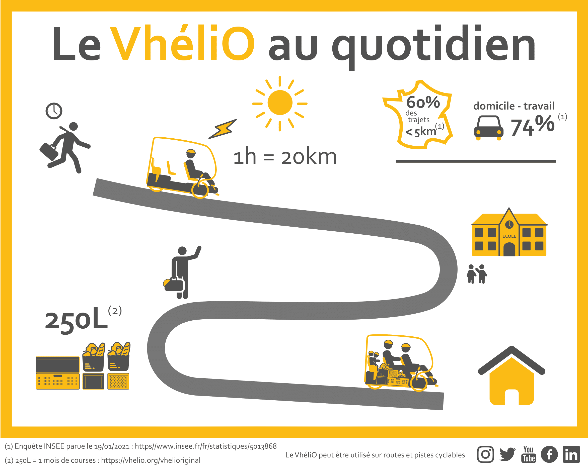
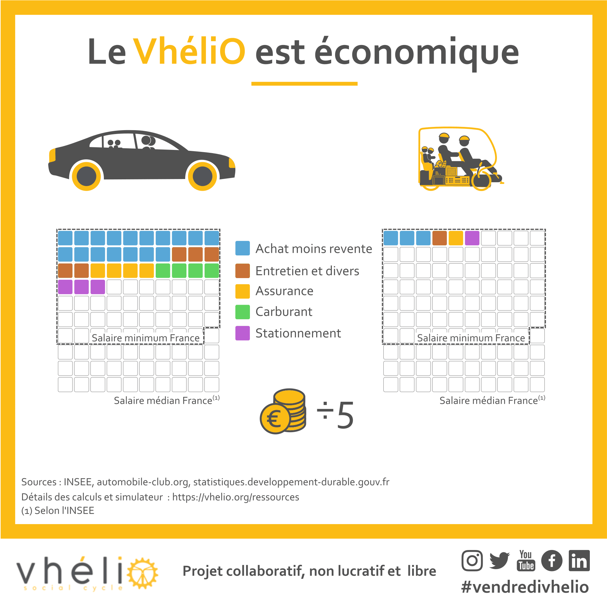
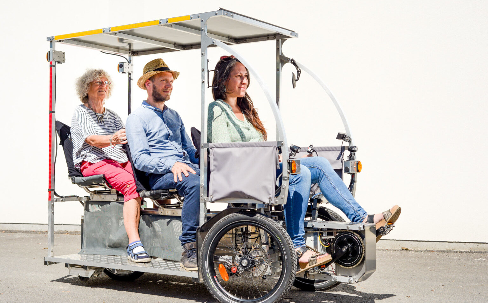
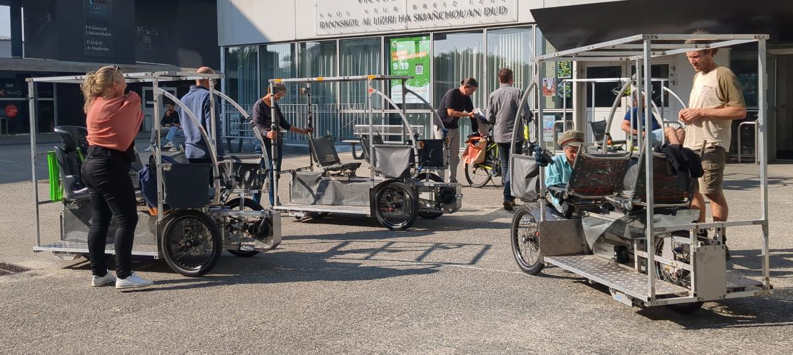

Un [Vhélio](https://vhelio.org) est un véhicule à assistance électrique qui comporte toutes les caractéristiques d'un vélo, dont une taille réduite. Il est stable, pratique et capable de transporter des personnes et des biens suivant sa configuration :

- 3 adultes,
- 1 adulte et 3 enfants,
- 1m3 de matériel,
- ou une combinaison de ces options.

## Le "Vhéliotech"

Ce modèle choisi comme base pour le prototype de l'archipel est un véhicule complet à fabriquer soi-même, dont <a href="https://documentation.vhelio.org/vheliotech/guide-de-montage/v1.0.0/" target="_blank">les plans</a> sont intégralement téléchargeables et en libre accès. De conception simple (low-tech), il peut être assemblé avec des techniques basiques et des outils simples (scie, visseuse, clé).

## Un véhicule pratique

Position ergonomique (transat), grande capacité de chargement utile (jusqu’à 200kg), compacité, rien n’est laissé au hasard. Ce véhicule évolue de façon agile et déplace facilement des personnes, des biens partout et sur des distances quotidiennes.

Cette nouvelle forme de mobilité n’oublie personne : celles et ceux qui n’ont pas le permis, celles et ceux qui ont des défauts d’équilibre / de motricité par exemple.

## Une solution DIY économique

5 à 10 fois moins cher que les moyens de déplacements démocratisés actuellement, il permet d'économiser ces derniers en les laissant à l'abri, voir de s'en passer.

Réparable à l'infini, le Vhélio permet des économies substantielles sur le long terme. Ses pièces sont accessibles et indépendantes de tout constructeur.

## Un objet inédit

Le Vhélio a été pensé pour s'inscrire dans la mobilité douce, avec un maximum de confort et de praticité.

:::tip[Et un mouvement en plein essor]
Le <a href="https://vhelio.org/le-projet-et-ses-valeurs/" target="_blank">projet du Vhélio</a> est <a href="https://vhelio.org/vhelio-quand-tout-a-commence/" target="_blank">né avec le confinement</a>. Depuis 2020, il connaît un succès grandissant avec, 4 ans plus tard, près de *50 unités en circulation et 128000€ mobilisés*. Le Vhélio, c'est aussi une association qui rassemble de nombreux passionnés, un esprit d'entre-aide et untipe volonté d'avancer ensemble.
:::

### Une forme originale

Cette morphologie iconoclaste est la synthèse d’une recherche approfondie portant sur le confort des passagers, les gabarits routiers/cyclables, les dimensions standards en logistique, l’agilité dynamique du véhicule, la facilité de pouvoir transporter des Vhélio.

### Une seule roue à l’arrière

Grâce à ce choix,  l’intégralité des pièces mécaniques liées à la motricité et au freinage restent des pièces standard de vélo. De plus, malgré les irrégularités du sol, chacune des 3 roues est toujours parfaitement posée au sol. Le Vhélio reste toujours stable.

### La poutre centrale

D’une largeur de 14cm, cette poutre loge toute la technique et confère une solidité considérable avec peu de matière. Largement démocratisée par Gustave Eiffel, ce principe a fait ses preuves dans de nombreuses applications.

### Les plateformes latérales

Chacune des deux marches latérales constitue une plateforme permettant d’arrimer au total quatre bacs de 60cm x 40cm (soit l’équivalent de la surface d’une palette, total = 250 litres). Les bacs étant situés à 15cm du sol, le Vhélio est particulièrement stable quand il est chargé y compris dans les virages et les freinages.

### La galerie solaire

Elle protège de la chaleur, de la pluie et collecte l’énergie solaire. Le Vhélio devient un générateur d’énergie capable de recharger tous les équipements électroniques. Par ailleurs, la galerie permet de transporter de grands objets (échelle, plaque, paquets…).

### Confort d'utilisation

Sobre, simple et confortable, le Vhélio obtient son amorti grâce à l’action combinée des sièges (souplesse des chambres à air recyclées) et des pneus dits « ballons » dont l'efficacité a largement convaincus les concepteurs au gré des essais.

:::note[En savoir plus sur le Vhélio]
Cette présentation et ses illustrations sont tirées <a href="https://vhelio.org/" target="_blank">du site officielle du projet Vhélio</a> sur lequel vous trouverez de nombreuses informations complémentaires.
:::

