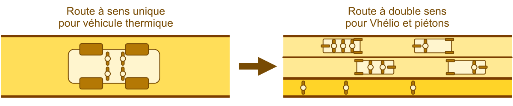

Le Vhélio présente de nombreux atouts pour compléter les moyens de transport traditionnels de nos îles (véhicules thermiques, vélos traditionnels et trajets à pied).

## Faciliter les trajets quotidiens

Assurer les trajets du quotidien (courses, travail, école) est facilité par la taille réduite, la stabilité et l'assistance électrique du Vhélio. Ce dernier peut emprunter routes et chemins étroits, se garer facilement.

:::tip[Qui pourrait utiliser le Vhélio sur l'archipel ?]
* *Les particuliers*, pour leurs trajets quotidiens.
* *Les commerçants* pour leurs livraisons.
* *Les touristes* pour faciliter leurs déplacements.
* *Les agents de la voie publique* pour leur travail.
* *Les administrations* pour les trajets de leurs employés.
:::

## Économiser la voiture traditionnelle

Pour cela deux cas peuvent se présenter : 

* **Ceux qui ne possèdent pas de voiture** parce qu'ils n'en ont pas fondamentalement besoin pourront adopter le Vhélio pour leurs trajets quotidiens : travail, courses, école. Ils gagneront du temps, de l'énergie et du confort dans leurs déplacements de matériel et de personnes.
* **Ceux qui ont besoin d'un véhicule thermique** pour des trajets longs pourront augmenter la durée de vie de celui-ci en le laissant au garage plus longtemps. Ainsi, les problèmes d'usure par corrosion (rouille) sur leur véhicule seront moins importants grâce à une utilisation exclusivement dédiée aux trajets longs.

## Un véhicule durable, démontable, réparable

Le Vhélio peut être entièrement fabriqué et réparé sur place. Outre sa conception élaborée avec des matériaux résistants à la corrosion, les pièces du Vhélio seront facilement et rapidement remplaçables. Il est réalisé de manière à être 100% démontable, en particulier dans sa version originale sans soudure.

:::note[Soudage VS Boulonnage]
Les plans du Vhélio ne comportent pas de soudures. Cependant, des assemblages soudés sont envisagés sur le prototype SPM pour :

- améliorer rigidité,
- optimiser les coûts (boulonnerie...),
- optimiser les formes des pièces.

Quoi qu'il en soit, l'accès à tous les éléments mécaniques et électriques devra se faire sans découpe. Et les deux solutions, avec et sans soudure, seront proposées aux futurs constructeurs de Vhélio.
:::

## Fabrication locale, souveraineté et résilience

Sur le long terme, un véhicule pratique et facile à fabriquer est une bonne option pour faire face aux contraintes liées à l'éloignement, ainsi qu'à la raréfaction des produits issu du pétrole.

D'autre part, une fabrication locale permet de limiter la dépendance de l'archipel à des acteurs privés extérieurs et optimiser les délais de réparation.

:::tip[Une filière économique en perspective]
Qui peut profiter de la généralisation du Vhélio ?

* **Les commerçants** locaux qui fournissent les pièces.
* **Les artisans** qui fabriquent et entretiennent les Vhélio.
* **Les acteurs du tourisme** qui proposent des Vhélio à la location.
:::

## Généralisation : vers une amélioration de la qualité de vie en ville

Sur le long terme, une généralisation de la mobilité douce rendrait le centre-ville plus agréable et fonctionnel. Les routes étroites pourraient être utilisées à double-sens avec de la place pour des trottoirs, les interactions sociales seraient favorisées, les émissions réduites et la sécurité des personne accrue.

:::note[De plus en plus de villes...]
Se lancent dans des projets de mobilité douce généralisée, <a href="https://www.enviesdeville.fr/transition-ecologique/oslo-capitale-verte/" target="_blank">dont une capitale de plus de 700000 habitants</a>.

- Pour une réelle amélioration de la qualité de vie.
- Mais aussi une volonté de résilience urbaine face aux défis à venir : effondrement des hydrocarbures, effets du changement climatique, etc.
:::